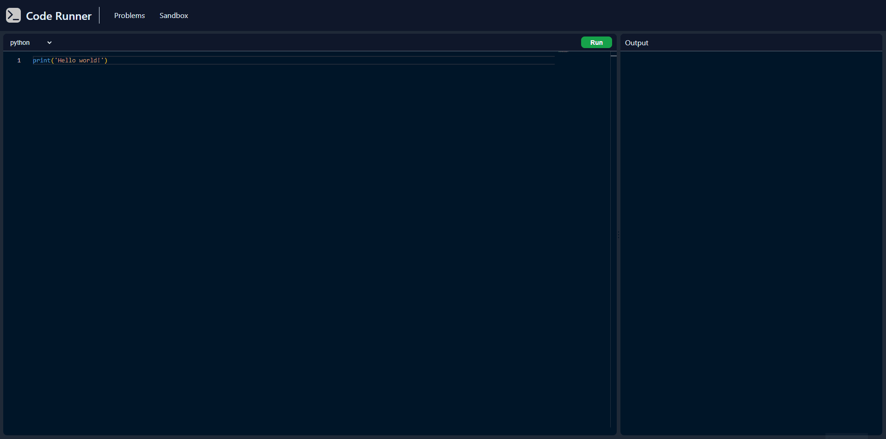
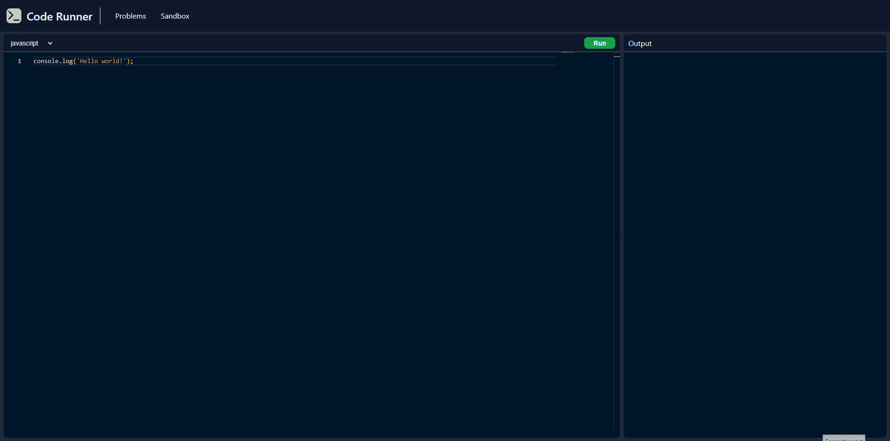

# CodeRunner

## Description

CodeRunner is Leetcode clone / Sandbox for testing code.

Sandbox
- Run code in multiple languages (C, C++, Python, Javascript)
- Run code with custom input



Leetcode clone
  - Select a problem from a list of problems
  - Solve problems in multiple languages (Python, Javascript)
  - Submit your solution to check if it's correct



### Requirements

- Node.js 
- Docker

## Installation for development

Clone the repository

```bash
git clone https://github.com/MatthieuFlaceliere/CodeRunner.git && cd CodeRunner
```

Install dependencies

```bash
cd client && npm install && cd ../server && npm install && cd ..
```

Create a .env file in the server folder

```bash
cd server && echo "" >>  .env
```

Add the following variables to the .env file

```bash
PORT=3000

# MONGODB
MONGODB_USERNAME=""
MONGODB_PASSWORD=""
MONGODB_HOST="127.0.0.1"
MONGODB_PORT="27017"
MONGODB_DB=""

# REDIS
REDIS_HOST="127.0.0.1"
REDIS_PORT="6379"
```

Run CodeRunner

```bash
# Redis & MongoDB
docker-compose -f docker-compose-local.yml up -d
```

```bash
# CodeRunner Server
cd server && npm run build && npm run start
```

```bash	
# CodeRunner Client
cd client && npm run start
```

Access CodeRunner at http://localhost:4200

Access CodeRunner API doc at http://localhost:3000/api-docs/

